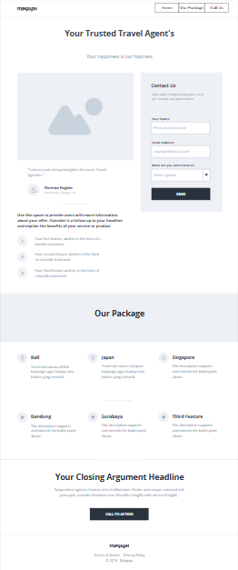
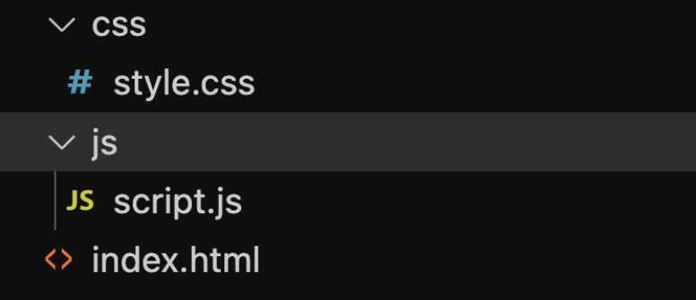

# Revou: Intro to Software Engineering (Mini Project)

**Disclaimer: *Proyek ini dibuat sebagai bagian dari mini-proyek untuk memenuhi persyaratan tugas akhir dalam kelas Software Engineering. Jika terdapat kesamaan dalam komponen atau elemen tertentu mungkin ini adalah kebetulan dan saya dengan tulus memohon maaf atas hal tersebut.***

Saya akan menjelaskan secara ringkas apa itu Revou. *Revou is an online education platform teaching driven individuals the skills they need for Indonesia’s most in-demand digital roles. The programs are 100% online so you can attend from anywhere. Learn directly from experienced industry practitioners, build your portofolio through project, and get support from career coaches— all to fast-track your digital career🚀.*

Dalam proyek yang saya terima, saya diberi tugas untuk mengubah tampilan mockup menjadi kode HTML,CSS, dan Javascript agar dapat diimplementasikan menjadi sebuah situs web. Berikut adalah rinciannya:

## Introduction

In this ten-day short course, you’ll learn all about becoming a software engineer, including the career path possibilities. We’ll also give you the opportunity to practice the main responsibilities of a software engineer as well!
Before you start...
1. Make sure you have downloaded Visual Studio Code, Git and have access to Google Chrome

## Mini Project Instructions
As a Software Engineer, you are asked to create a website for travel agents. You must create banner, information about traveling packages on the home page. Get your client personal information and inquiries (Name, Email, Travel Destination) by using JavaScript validation. Create a website using the mockup design below (completed mockup on this link [mockup](https://app.moqups.com/Y8iumYO1yOg5P2v9YSZ4pW7u8Hs15D2s/view/page/abaae0961)) 

Workflow:
1. Slicing according to the mockup above
2. Navigation in One Page 
* Home = Banner Section (Top of Pages Content)
* Our Package Section (Middle of Pages Content)
* Call Action Section (Bottom of Pages Content)
3. Banner use auto slide using JavaScript
4. Form Contact Us implements JavaScript Validation.
5. Implement Responsive Design on each page (on Desktop and Mobile)
6. Put css file inside of the css/ folder
7. Please only put only 1 css for the entirety of the project
8. Put javascript files inside the js/ folder
9. Please put only 1 javascript file for the entirety of the project
10. After finish your website, upload Source Code in GitHub Classroom and publish the website in Github Pages
11. Submit URL repository and published website through dedicated Typeform submission that will be opened on Wednesday week 2 

Mandatory pages (required) : 
index.html (Home Page)
style.css (Home Page CSS)

## Mandatory pages (required) : 
1. index.html (Home Page)
2. style.css (Home Page CSS)

## Expected file structure:

